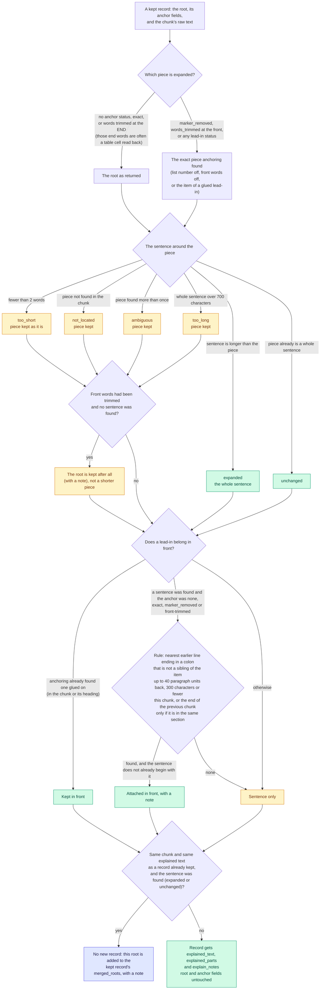

# Context attaching

How the explained text beside each quote is built.

```mermaid
flowchart TD
    IN["A kept record: the root, its anchor fields,<br/>and the chunk's raw text"]
    P{"Which piece is expanded?"}
    P1["The root as returned"]
    P2["The exact piece anchoring found<br/>(list number off, front words off,<br/>or the item of a glued lead-in)"]

    IN --> P
    P -->|"no anchor status, exact,<br/>or words trimmed at the END<br/>(those end words are often a table cell read back)"| P1
    P -->|"marker_removed, words_trimmed at the front,<br/>or any lead-in status"| P2

    P1 --> X
    P2 --> X
    X{"The sentence around the piece"}
    X -->|"fewer than 2 words"| O1["too_short<br/>piece kept as it is"]
    X -->|"piece not found in the chunk"| O2["not_located<br/>piece kept"]
    X -->|"piece found more than once"| O3["ambiguous<br/>piece kept"]
    X -->|"whole sentence over 700 characters"| O4["too_long<br/>piece kept"]
    X -->|"sentence is longer than the piece"| O5["expanded<br/>the whole sentence"]
    X -->|"piece already is a whole sentence"| O6["unchanged"]

    O1 --> T
    O2 --> T
    O3 --> T
    O4 --> T
    T{"Front words had been trimmed<br/>and no sentence was found?"}
    T -->|yes| T1["The root is kept after all<br/>(with a note), not a shorter piece"]
    T -->|no| L
    O5 --> L
    O6 --> L
    T1 --> L

    L{"Does a lead-in belong in front?"}
    L -->|"anchoring already found one glued on<br/>(in the chunk or its heading)"| L1["Kept in front"]
    L -->|"a sentence was found and the anchor was none,<br/>exact, marker_removed or front-trimmed"| L2{"Rule: nearest earlier line ending in a colon<br/>that is not a sibling of the item<br/>up to 40 paragraph units back, 300 characters or fewer<br/>this chunk, or the end of the previous chunk<br/>only if it is in the same section"}
    L -->|"otherwise"| L4["Sentence only"]
    L2 -->|"found, and the sentence does not already begin with it"| L3["Attached in front, with a note"]
    L2 -->|"none"| L4

    L1 --> M
    L3 --> M
    L4 --> M
    M{"Same chunk and same explained text<br/>as a record already kept,<br/>and the sentence was found (expanded or unchanged)?"}
    M -->|yes| M1["No new record: this root is added to the<br/>kept record's merged_roots, with a note"]
    M -->|no| M2["Record gets explained_text, explained_parts<br/>and explain_notes<br/>root and anchor fields untouched"]

    classDef ok fill:#d1fae5,stroke:#059669,color:#064e3b;
    classDef keep fill:#fef3c7,stroke:#d97706,color:#78350f;
    classDef note fill:#e0e7ff,stroke:#4f46e5,color:#1e1b4b;
    class O5,O6,L1,L3,M2 ok;
    class O1,O2,O3,O4,T1,L4 keep;
    class M1 note;
```

The explained text is a separate layer beside the root. The root is never edited.

Back to the [diagram index](README.md).
