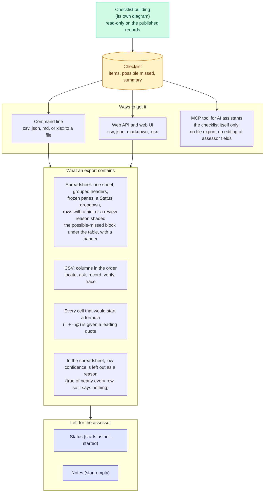

# Delivery

How the checklist reaches an assessor.

```mermaid
flowchart TD
    GEN["Checklist building<br/>(its own diagram)<br/>read-only on the published records"]
    ENV[("Checklist<br/>items, possible missed, summary")]
    GEN --> ENV

    subgraph OUTS["Ways to get it"]
        CLI["Command line<br/>csv, json, md, or xlsx to a file"]
        API["Web API and web UI<br/>csv, json, markdown, xlsx"]
        MCP["MCP tool for AI assistants<br/>the checklist itself only:<br/>no file export, no editing of assessor fields"]
    end
    ENV --> CLI
    ENV --> API
    ENV --> MCP

    subgraph FILE["What an export contains"]
        X1["Spreadsheet: one sheet, grouped headers,<br/>frozen panes, a Status dropdown,<br/>rows with a hint or a review reason shaded<br/>the possible-missed block under the table, with a banner"]
        X2["CSV: columns in the order<br/>locate, ask, record, verify, trace"]
        X3["Every cell that would start a formula<br/>(= + - @) is given a leading quote"]
        X4["In the spreadsheet, low confidence is left out as a reason<br/>(true of nearly every row, so it says nothing)"]
    end
    CLI --> FILE
    API --> FILE

    subgraph ASSESSOR["Left for the assessor"]
        A1["Status (starts as not-started)"]
        A2["Notes (start empty)"]
    end
    FILE --> ASSESSOR

    classDef built fill:#d1fae5,stroke:#059669,color:#064e3b;
    classDef data fill:#fef3c7,stroke:#d97706,color:#78350f;
    classDef side fill:#e0e7ff,stroke:#4f46e5,color:#1e1b4b;
    class GEN built;
    class ENV data;
    class A1,A2 side;
```

One checklist, built the same way for every route.

Back to the [diagram index](README.md).
